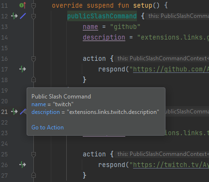

# KordEx-Intellij-Plugin

An intellij plugin to help you develop with the Discord Library [KordEx](https://github.com/Kord-Extensions/kord-extensions).

<iframe frameborder="none" width="245px" height="48px" src="https://plugins.jetbrains.com/embeddable/install/19163"></iframe>

It currently has the following features:

- Adds gutter icons to Commands and Events, blue is for public, gold is for ephemeral, each type has its proper icon.
- Moves you to `action` DSL when you click on it.
